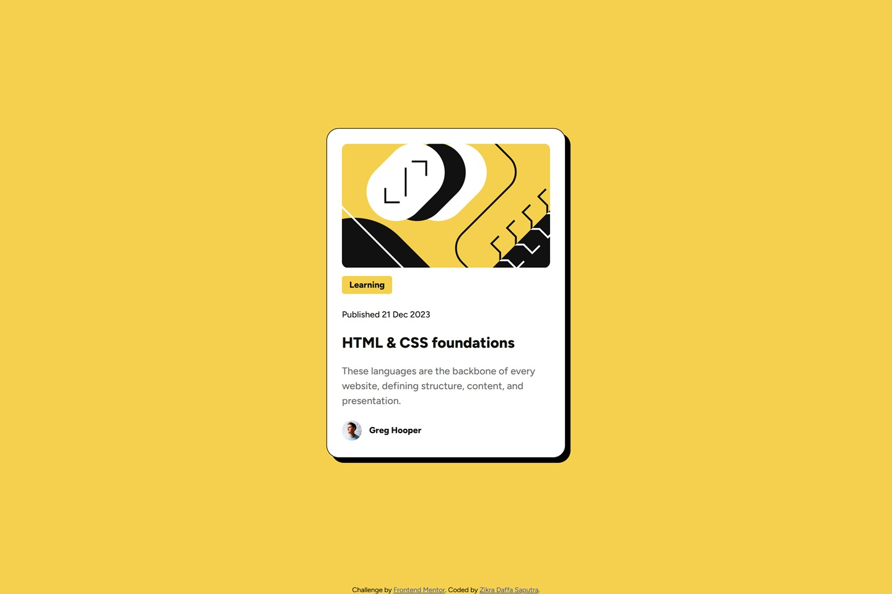

# Frontend Mentor - Blog Preview Card Solution

This is my solution to the **Blog Preview Card** challenge on Frontend Mentor. The objective of this project is to recreate a responsive blog card component while practicing semantic HTML, CSS styling, and interactive hover states.

## Preview



## Links

- **Live Site:** https://shrigel.github.io/blog-preview-card/
- **Frontend Mentor Challenge:** https://www.frontendmentor.io/challenges/blog-preview-card-ckPaj01IcS

## Built With

- Semantic HTML5
- CSS3
- Google Fonts (Figtree)

## Layout

The original design was created for the following viewport widths:

- **Mobile:** 375px
- **Desktop:** 1440px

The component remains responsive and centered across different screen sizes while maintaining the original design proportions.

## Style Guide

### Colors

| Color | HSL |
|--------|-----|
| Yellow | `hsl(47, 88%, 63%)` |
| White | `hsl(0, 0%, 100%)` |
| Gray 500 | `hsl(0, 0%, 42%)` |
| Gray 950 | `hsl(0, 0%, 7%)` |

### Typography

**Body Copy**

- Paragraph font size: **16px**

**Font**

- **Family:** [Figtree](https://fonts.google.com/specimen/Figtree)
- **Weights:** 500, 800

## Project Structure

```text
├── images
│   ├── favicon-32x32.png
│   ├── illustration-article.svg
│   ├── image-avatar.webp
│   └── preview.jpg
├── index-styles.css
├── index.html
└── README.md
```

## What I Practiced

Through this project, I practiced:

- Building a semantic card layout with HTML.
- Using CSS Custom Properties to create a maintainable color system.
- Creating responsive spacing and sizing with `rem` units.
- Implementing interactive hover states for better user experience.
- Reproducing a design specification with accurate typography, borders, and shadows.

## Author

- GitHub - [@shrigel](https://github.com/shrigel)
- Frontend Mentor - [@shrigel](https://www.frontendmentor.io/profile/shrigel)